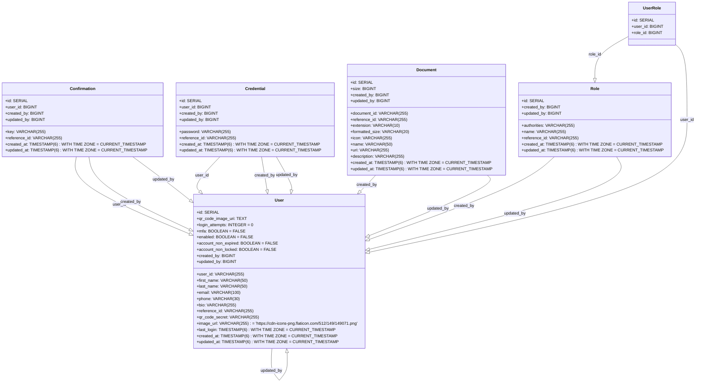
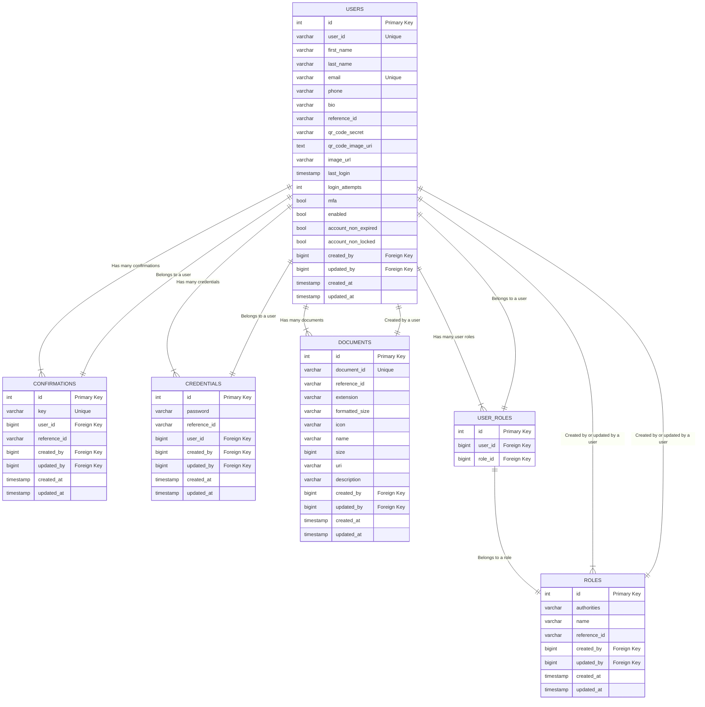
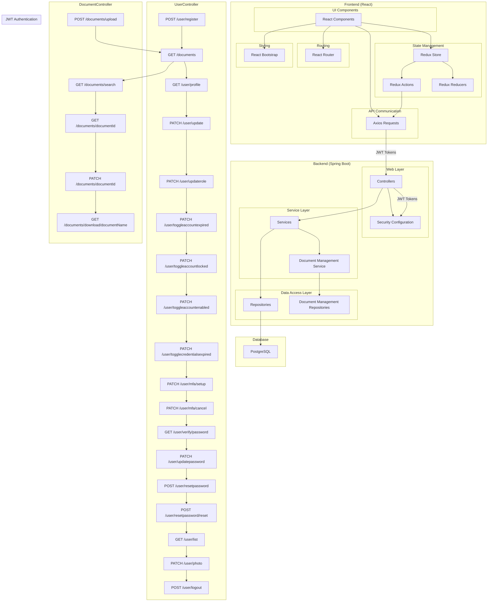

## Document Management System

## Introduction
The Secure Document Management System is a robust and user-friendly application designed to securely store, update, upload, and delete documents. This application addresses the need for a centralized and secure repository for sensitive information, offering a seamless and efficient solution for document management.
The Secure Document Management System offers a comprehensive solution for organizations to securely store, manage, and collaborate on documents. With robust security measures and a user-friendly interface, it addresses the needs of businesses requiring a reliable and secure document management platform.

## Key Features

### User Authentication and Authorization
Users must authenticate themselves to access the system, ensuring secure access.

### Multi-Factor Authentication (MFA)
Users can enable MFA for an additional layer of security during login.

### Access Control
Role-based access control allows to define user privileges based on their roles and permissions, maintaining data integrity.
Authorized users can perform actions (update, delete, etc) on documents.

### Document Upload
Users can easily upload documents through a user-friendly interface.
Supported document formats include DOC, DOCX, XLS, PDFs, etc.

### Document Search
A powerful search feature enables users to quickly locate specific documents based on document metadata (name, file extension).
Users can search, filter, and go through different pages of documents.
Advanced filtering options enhance document retrieval efficiency.

### Audit Trail
The system logs all user activities, providing a detailed audit trail.
Audit logs help administrators monitor and review user actions for security and compliance purposes.

# Functional Requirements

## User Account

**New Account**
1. The application should allow users to create a new account using basic information, email(all emails are unique), and password.
2. The application should disabled all newly created accounts until verified.
3. The application should send an email with a link to confirm new user account.
4. Only after verifying a new account should a user be able to log into the application.

**Log In**
1. The application should allow users to enter an email and password to log in.
2. If MFA is set up, the application should ask for a QR code after entering correct email and password.
3. After 6 failed login attempts, user account should be locked for 15 minutes (mitigate brute force attack).
4. After 90 days, user password should expire therefore can't log in until password is updated (password rotation).

**Reset Password**
1. The application should allow users to reset their password.
2. The application should send a link to users' email to reset their password (link to be invalid after being clicked on).
3. The application should present a screen with a form to reset password when the link is clicked.
4. If a password is reset successfully, user should be able to log in using the new password.
5. The application should allow users to reset their password as many times as they need.

**MFA (Multi-Factor Authentication)**  
1. The application should allow users to set up Multi-Factor Authentication to help secure their account.
2. Multi-Factor Authentication should use a QR code on users' mobile phone.
3. The application should allow users to scan a QR code using an authenticator application on their phone to set up Multi-Factor Authentication.
4. The application should ask users to enter the QR code from their mobile phone authenticator application in order to log in successfully.

**Profile**
1. The application should allow users to update their basic information while logged in.
2. The application should allow users to update their password while logged in.
3. The application should allow users to update their account settings while logged in.
4. The application should allow users to update their profile picture while logged in.

## Document Management

**Document List**
1. The application should show a list of all the documents uploaded in the homepage.
2. The application should show some details (name, size, owner, type, etc) about each document in the list. 
3. The application should allow logged in users to upload new documents.
4. The application should have pagination for the document list.
5. The application should allow to set how many documents to display per page.
6. The application should allow to search documents by name (result should also include pagination).
7. The application should allow to click on a document to see more details.

**Document Details**
1. The application should show details of a document when clicked on.
2. The document details should include document owner.
3. The application should allow to update the name and description of a document (in detail page).
4. The application should allow to download a document (in detail page).
5. The application should allow to delete the document (in detail page).

## Access Control
**User Role**
1. The application should give roles to users.
2. The application roles should contain specific permissions (authorities).
3. The application roles should grant different access levels.
4. The application should allow only users with proper roles to be able to perform certain actions.
5. The application should only allow non-user role users to update account settings.
6. The application should only allow non-user role users to update account roles.
7. The application should only allow users with "delete" document permission to delete documents.
8. The application should only allow non-user role users to view other users in the system. 

## Audit Trail
1. The application should keep track of who created an entity (user, document, etc).
2. The application should keep track of when an entity (user, document, etc) was created.
3. The application should keep track of who updated an entity (user, document, etc). 
4. The application should keep track of when an entity (user, document, etc) was updated.

## Domain Model Class Diagram

## Database Design ER-Diagram

## High Level Architecture Diagram

